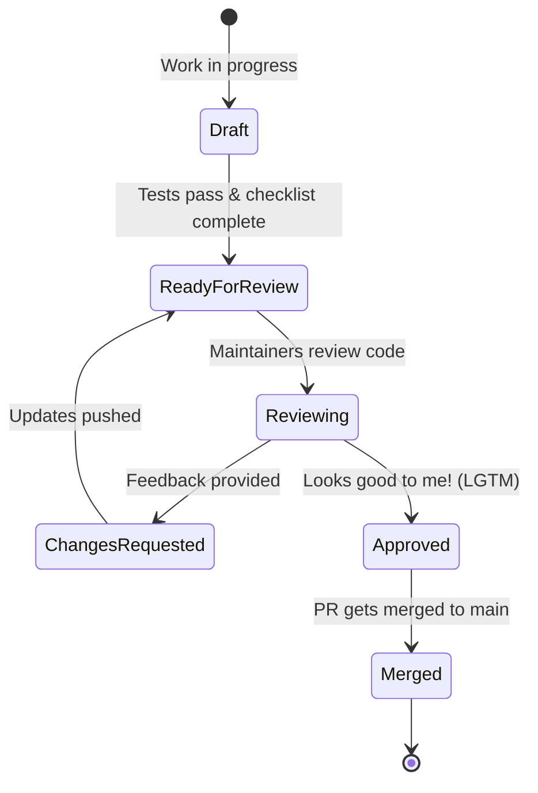

<!--
Welcome to Faith and Fast! We appreciate your contribution!

Please follow the PR lifecycle below to ensure a smooth review process:

-->

## 🔗 Related Issue
<!-- Link to the issue this PR addresses (e.g., "Fixes #123" or "Resolves #456") -->
Fixes # (issue)

## 📝 Description of Changes
<!-- Provide a clear and concise summary of the changes you've made. -->
-
-
-

## 🔄 Type of Change
<!-- Check the relevant option(s) below -->
- [ ] 🐛 Bug fix (non-breaking change which fixes an issue)
- [ ] ✨ New feature (non-breaking change which adds functionality)
- [ ] 💥 Breaking change (fix or feature that would cause existing functionality to not work as expected)
- [ ] 📖 Documentation update
- [ ] 🚀 Performance improvement or refactoring

## 📸 Screenshots / Video (if applicable)
<!-- If your changes affect the UI or user flow, please include screenshots or a short screen recording -->
| Before | After |
|--------|-------|
|        |       |

## 🧪 Testing Performed
<!-- Describe the tests that you ran to verify your changes. Provide instructions so we can reproduce them. -->
- [ ] Verified local development build (`npm start`)
- [ ] Verified tests locally (`npm test`)
- [ ] Edge cases tested: (list here)

## ✅ Contributor Checklist:
<!-- Ensure all these boxes are checked before requesting a review -->
- [ ] My code follows the style guidelines of this project (no linting errors).
- [ ] I have performed a self-review of my own code.
- [ ] I have commented my code, particularly in hard-to-understand areas.
- [ ] I have made corresponding changes to the documentation (if needed).
- [ ] My changes generate no new warnings.
- [ ] I have added tests that prove my fix is effective or that my feature works.
- [ ] Any dependent changes have been merged and published in downstream modules.
- [ ] I have checked that there are no merge conflicts with the `main` branch.

## 💬 Additional Context
<!-- Add any other context or questions you have about the pull request here. -->
```
