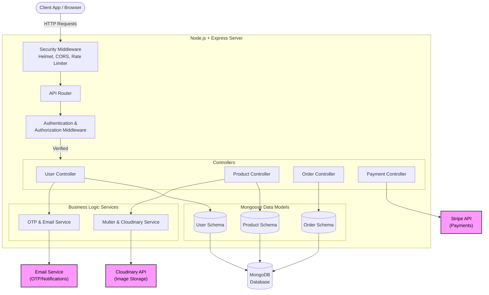

# Faith & Fast - Architecture Overview

This document provides a high-level overview of the backend architecture for the Faith & Fast platform. The application is built using Node.js, Express, and MongoDB, leveraging several third-party services for payments and image handling.

## 🏗️ System Architecture

The following diagram illustrates the end-to-end data flow and architectural components of the application.

## 🧩 Key Components

1. **Security & Middleware Layer**:
   - Uses `helmet` for HTTP headers.
   - Centralized `Rate-Limiter` to prevent brute force and DDoS attacks.
   - Custom Authentication middleware validates JWT tokens before allowing access to protected routes.

2. **Controllers & Routing**:
   - Routes are separated by domain logic (`users`, `products`, `orders`).
   - Controllers handle request parsing, business logic orchestration, and HTTP response formatting.

3. **Database Layer (MongoDB/Mongoose)**:
   - Data is stored in collections, represented by Mongoose schemas.
   - Validation and relationships are strictly enforced at the schema level.

4. **External Integrations**:
   - **Stripe**: Handles checkout sessions and payment intents securely.
   - **Cloudinary**: Handles user avatars and product image uploads.
   - **Nodemailer / OTP Service**: Manages verification emails and password resets.

## 📂 Directory Structure

The repository follows a standard MVC-inspired structure:

- `src/controllers/` - Route handler logic.
- `src/models/` - Mongoose database schemas.
- `src/routes/` - Express route definitions.
- `src/middleware/` - Custom middleware (Auth, Security, Error handling).
- `src/utils/` - Helper functions and shared utilities.
- `docs/` - Comprehensive project documentation.
